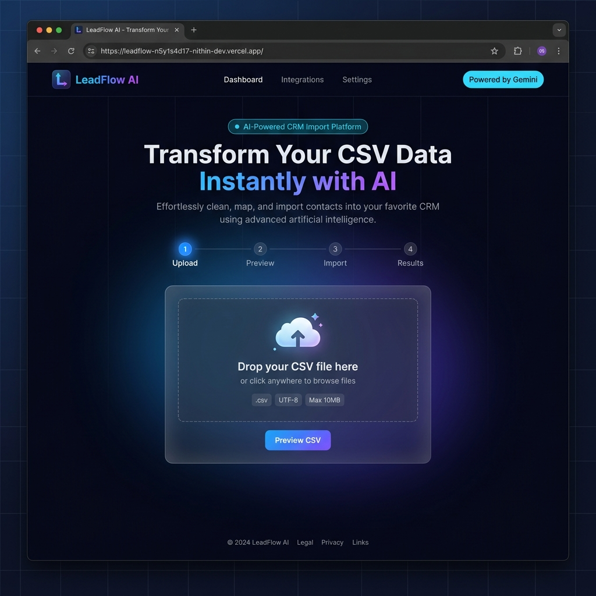
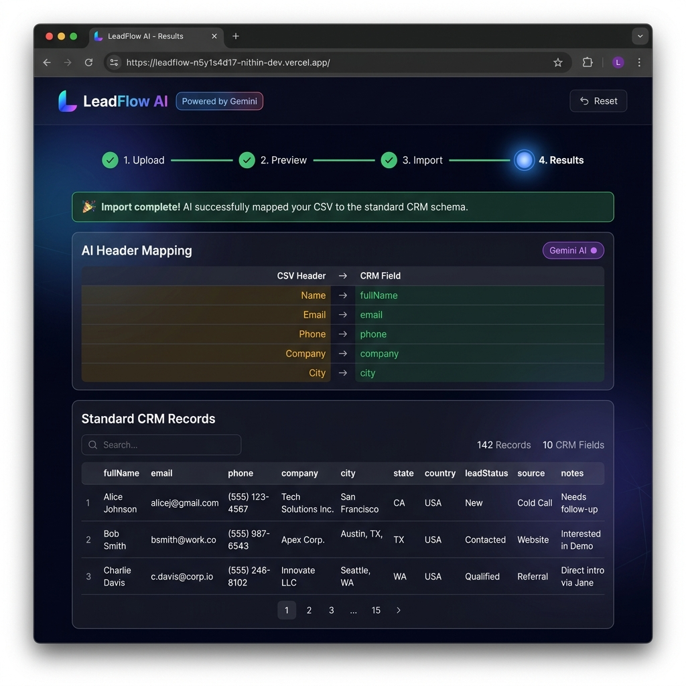

# 🚀 LeadFlow AI

> AI-powered CRM data import platform that transforms any messy CSV file into a standardized CRM schema — automatically, using Google Gemini.

<div align="center">


</div>

---

## 🌐 Live Demo

<div align="center">

| | Link | Platform |
|--|------|----------|
| 🎨 **Frontend** | [leadflow-n5y1s4d17-nithin-dev.vercel.app](https://leadflow-n5y1s4d17-nithin-dev.vercel.app/) | [](https://leadflow-n5y1s4d17-nithin-dev.vercel.app/) |
| ⚙️ **Backend API** | [leadflow-ai-t3d7.onrender.com](https://leadflow-ai-t3d7.onrender.com/) | [](https://leadflow-ai-t3d7.onrender.com/) |

> **Note:** The Render backend is on a free tier — it may take **~30 seconds** to wake up on the first request.

</div>

---

## 📖 Overview

One of the biggest pain points in CRM onboarding is **inconsistent CSV column names**. Every sales team exports data differently — `"Full Name"`, `"Name"`, `"Contact"`, `"Client"` all mean the same thing but break manual import pipelines.

**LeadFlow AI** solves this completely. Upload any CSV, and Google Gemini AI reads the column headers, understands their intent, and maps them to a standardized CRM schema automatically. No manual mapping. No template downloads. No failed imports.

---

## 🖼️ Screenshots

### Upload & Preview



*Drag & drop your CSV file into the upload zone. The 4-step progress tracker guides you through the entire import flow.*

### AI Mapping & CRM Results



*After running the AI import, Gemini maps every CSV column to its CRM field (shown in amber → green). The results table supports live search and pagination.*

---

## ✨ Features

| Feature | Description |
|---------|-------------|
| 📂 **Drag & Drop Upload** | Click or drag any `.csv` file into the upload zone |
| 👁️ **CSV Preview** | See the first 5 rows and all headers before committing to import |
| 🤖 **AI Header Mapping** | Google Gemini maps your CSV columns to standard CRM fields |
| 🔄 **Row Transformation** | Every row is transformed to a clean, consistent CRM record |
| 🧠 **In-Memory Sessions** | Temporary import sessions (UUID-based) with automatic cleanup |
| 🛡️ **CSV Validation** | File type, size (5 MB max), MIME type, and empty file checks |
| ⚡ **Fast Parsing** | PapaParse handles large CSVs efficiently |
| 🧹 **Auto File Cleanup** | Uploaded files are deleted from disk immediately after parsing |
| ❌ **Global Error Handling** | Consistent JSON error responses across all endpoints |
| 🔍 **Search & Pagination** | Filter and page through results in the UI (10 records/page) |
| 📱 **Responsive UI** | Fully responsive — works on desktop and mobile |

---

## 🏛️ Architecture

```
                        User Browser
                             │
                    ┌────────▼────────┐
                    │   React + Vite  │
                    │   Frontend UI   │
                    └────────┬────────┘
                             │  HTTP (Axios)
                    ┌────────▼────────────────────┐
                    │     Express.js Backend       │
                    │         /api/v1              │
                    └──────┬───────────┬───────────┘
                           │           │
               ┌───────────▼─┐   ┌─────▼───────────┐
               │ POST/preview │   │  POST /import   │
               └───────────┬─┘   └─────┬───────────┘
                           │           │
               ┌───────────▼─┐   ┌─────▼──────────────────┐
               │   Multer    │   │  In-Memory Store        │
               │  (Upload)   │   │  getImportData(id)      │
               └───────────┬─┘   └─────┬──────────────────┘
                           │           │
               ┌───────────▼─┐   ┌─────▼──────────────────┐
               │  PapaParse  │   │  Gemini AI              │
               │  (Parse CSV)│   │  Header Mapping Prompt  │
               └───────────┬─┘   └─────┬──────────────────┘
                           │           │
               ┌───────────▼─┐   ┌─────▼──────────────────┐
               │  UUID Store │   │  Row Transformer        │
               │  (Session)  │   │  → Standard CRM JSON    │
               └─────────────┘   └────────────────────────┘
```

---

## 🔄 Import Workflow

### Step 1 — Upload & Preview

```
User selects CSV
      │
      ▼
Multer Middleware
(validates type, size, MIME)
      │
      ▼
PapaParse Service
(parse headers + rows)
      │
      ▼
Auto-delete file from disk
      │
      ▼
Store parsed data in memory (UUID session)
      │
      ▼
Return: { importId, preview, headers, totalRows }
```

### Step 2 — AI Import

```
User clicks "Run AI Import"
      │
      ▼
Retrieve session by importId
      │
      ▼
Build Gemini header mapping prompt
      │
      ▼
Gemini AI → fieldMapping JSON
      │
      ▼
Transform all rows using mapping
      │
      ▼
Delete session from memory
      │
      ▼
Return: { mapping, records }
```

---

## 🗂️ Project Structure

```
leadflow-ai/
│
├── backend/
│   └── src/
│       ├── controllers/
│       │   ├── preview.controller.js    # Handles CSV upload + parse
│       │   ├── import.controller.js     # Handles AI import trigger
│       │   └── gemini.controller.js     # (Gemini direct route)
│       │
│       ├── routes/
│       │   ├── preview.routes.js        # POST /api/v1/preview
│       │   ├── import.routes.js         # POST /api/v1/import
│       │   └── gemini.routes.js
│       │
│       ├── services/
│       │   ├── csv/
│       │   │   ├── parseCsv.service.js  # PapaParse wrapper
│       │   │   └── importCsv.service.js # Gemini + transform orchestration
│       │   ├── ai/
│       │   │   └── gemini.service.js    # Google Gemini API client
│       │   └── transform.service.js     # Row → CRM record transformer
│       │
│       ├── middlewares/
│       │   ├── upload.middleware.js     # Multer config + validation
│       │   └── error.middleware.js      # Global error handler
│       │
│       ├── storage/
│       │   └── import.storage.js        # In-memory Map for sessions
│       │
│       ├── prompts/
│       │   └── headerMapping.prompt.js  # Gemini prompt builder
│       │
│       ├── validators/                  # Zod schema validators
│       ├── constants/                   # CRM field definitions
│       ├── config/                      # App configuration
│       ├── app.js                       # Express app setup
│       └── server.js                    # HTTP server entry point
│
├── frontend/
│   └── src/
│       ├── components/
│       │   ├── UploadForm.jsx           # Drag-and-drop CSV upload
│       │   ├── PreviewTable.jsx         # CSV preview with stats
│       │   ├── ImportButton.jsx         # AI import trigger + status
│       │   ├── MappingTable.jsx         # Gemini field mapping display
│       │   └── ResultTable.jsx          # CRM records + search + pages
│       ├── api/
│       │   └── api.js                   # Axios instance
│       ├── App.jsx                      # Root: layout, stepper, state
│       ├── main.jsx                     # React entry point
│       └── index.css                    # Full design system
│
└── docs/
```

---

## 🛠️ Tech Stack

### Backend
| Technology | Version | Purpose |
|-----------|---------|---------|
| Node.js | 22.x | Runtime |
| Express.js | 5.x | HTTP framework |
| `@google/genai` | 2.x | Gemini AI SDK |
| PapaParse | 5.x | CSV parsing |
| Multer | 2.x | File upload handling |
| UUID | 14.x | Import session IDs |
| Zod | 4.x | Schema validation |
| dotenv | 17.x | Environment config |
| CORS | 2.x | Cross-origin requests |

### Frontend
| Technology | Version | Purpose |
|-----------|---------|---------|
| React | 19.x | UI framework |
| Vite | 8.x | Build tool & dev server |
| Axios | 1.x | HTTP client |
| Inter (Google Fonts) | — | Primary typeface |
| JetBrains Mono | — | Monospace (code/IDs) |
| Vanilla CSS | — | Full design system |

---

## 📡 API Reference

### `GET /health`

Health check endpoint.

**Response**
```json
{
  "message": "LeadFlow AI Backend is running.."
}
```

---

### `POST /api/v1/preview`

Upload a CSV file and receive a preview + import session.

**Request** — `multipart/form-data`

| Field | Type | Description |
|-------|------|-------------|
| `file` | File | `.csv` file, max 5 MB |

**Response `200`**
```json
{
  "success": true,
  "importId": "a1b2c3d4-...",
  "headers": ["Name", "Email", "Phone", "Company"],
  "preview": [
    { "Name": "John Doe", "Email": "john@example.com", "Phone": "555-1234", "Company": "Acme" }
  ],
  "totalRows": 142
}
```

**Errors**

| Code | Message |
|------|---------|
| `400` | `CSV file is required` |
| `400` | `CSV file is empty` |
| `400` | `CSV file must be under 5 MB` |
| `400` | `Only CSV files are allowed` |

---

### `POST /api/v1/import`

Run AI header mapping and transform all rows to CRM records.

**Request** — `application/json`

```json
{
  "importId": "a1b2c3d4-..."
}
```

**Response `200`**
```json
{
  "success": true,
  "importId": "a1b2c3d4-...",
  "mapping": {
    "fieldMapping": {
      "Name":    "fullName",
      "Email":   "email",
      "Phone":   "phone",
      "Company": "company"
    }
  },
  "records": [
    {
      "fullName": "John Doe",
      "email":    "john@example.com",
      "phone":    "555-1234",
      "company":  "Acme",
      "city":     "",
      "state":    "",
      "country":  "",
      "leadStatus": "",
      "source":   "",
      "notes":    ""
    }
  ]
}
```

**Errors**

| Code | Message |
|------|---------|
| `400` | `importId is required` |
| `404` | `Import not found` |
| `502` | `Gemini returned invalid JSON` |
| `502` | `Gemini mapping is invalid` |

---

## 🎯 Standard CRM Schema

Every imported record is normalized to this schema:

| Field | Type | Description |
|-------|------|-------------|
| `fullName` | string | Contact's full name |
| `email` | string | Email address |
| `phone` | string | Phone number |
| `company` | string | Company / organization |
| `city` | string | City |
| `state` | string | State / province |
| `country` | string | Country |
| `leadStatus` | string | Lead stage (e.g. New, Qualified) |
| `source` | string | Lead source (e.g. LinkedIn, Web) |
| `notes` | string | Additional notes |

Unmapped or unrecognized columns are marked `"unknown"` by Gemini and omitted from records.

---

## 🚀 Getting Started

### Prerequisites

- Node.js ≥ 18
- A [Google Gemini API key](https://ai.google.dev)

---

### 1. Clone the repository

```bash
git clone https://github.com/nithin-code-web/leadflow-ai.git
cd leadflow-ai
```

---

### 2. Backend setup

```bash
cd backend
npm install
```

Create a `.env` file:

```env
PORT=5000
GEMINI_API_KEY=your_gemini_api_key_here
```

Start the backend:

```bash
npm run dev     # Development (nodemon)
npm start       # Production
```

Backend runs at → `http://localhost:5000`

---

### 3. Frontend setup

```bash
cd frontend
npm install
npm run dev
```

Frontend runs at → `http://localhost:5173`

---

### 4. Use the app

1. Open `http://localhost:5173`
2. Drag & drop or click to upload a `.csv` file
3. Review the preview (first 5 rows, column headers, total row count)
4. Click **Run AI Import** — Gemini maps your headers automatically
5. Review the AI field mapping and browse the transformed CRM records
6. Use the live search and pagination to explore your data

---

## 📌 Current Capabilities

- ✅ Single CSV file import (up to 5 MB)
- ✅ AI header mapping via Google Gemini
- ✅ Full row transformation to standard CRM schema
- ✅ UUID-based temporary import sessions
- ✅ Automatic file and session cleanup
- ✅ Client-side search and pagination
- ✅ Responsive premium dark UI

---

## 🚧 Roadmap

- [ ] Multi-file / folder batch upload
- [ ] Duplicate contact detection
- [ ] Background job processing (queue)
- [ ] Import history & audit log
- [ ] Database persistence (PostgreSQL / MongoDB)
- [ ] User authentication & multi-tenant support
- [ ] Export cleaned data as CSV / JSON
- [ ] Manual field mapping override UI
- [ ] Progress tracking for large files
- [ ] Webhook notifications on import complete

---

## 🤝 Contributing

Contributions, ideas, and pull requests are welcome!

1. Fork the repository
2. Create a feature branch: `git checkout -b feat/your-feature`
3. Commit your changes: `git commit -m 'feat: add your feature'`
4. Push to the branch: `git push origin feat/your-feature`
5. Open a Pull Request

Please follow [Conventional Commits](https://www.conventionalcommits.org/) for commit messages.

---

## 👨‍💻 Author

**Nithin Budime** — Backend Developer & AI Enthusiast

[](https://github.com/nithin-code-web)
[](https://linkedin.com/in/nithin-budime)

---

<div align="center">
  <sub>Built with ❤️ using Node.js, React, and Google Gemini AI</sub>
</div>